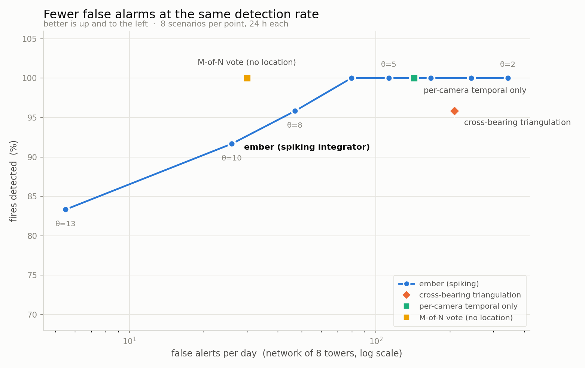

# wild-fire-integrator

**Spiking evidence fusion for wildfire camera networks.**
Cameras stop being alarm sources and become sensory neurons.

Built for the [Resilient America Preparedness Challenge](https://deveco.io/contests/qualcommforamoreresilientamerica)
(Qualcomm for Good · devEco · EDGE AI Foundation), targeting the Arduino UNO Q.

---

## The problem

Wildfire camera networks do not have a detection problem. They have an
**attention problem** — roughly 1,000 false alarms a day across California,
each resolved by a person looking. At two minutes a check that is 33 hours of
human attention every day, more than four full shifts, spent on cloud and dust.

ALERTCalifornia runs 1,000+ AI cameras at "less than one false positive per day
per camera" — roughly **1,000 false alarms a day network-wide**, every one of
them absorbed by a human watchstander. The failure modes are well documented:
cloud, fog, dust, and geothermal or industrial steam. Temporal confirmation is
known to cut false-alarm rates from 52% to 4%, but today a *person* does that
confirming, and that person is the bottleneck that caps how far these networks
can scale.

This repo is not another smoke detector. It is the layer above them — the part
that decides, from many weak and unreliable signals, whether anything is
actually burning and *where*.

## The idea

Each camera emits a **16-byte event** — not a frame — and a two-layer spiking
network fuses them:

| | runs on | integrates over | asks |
|---|---|---|---|
| **Layer 1** `ember_node` | the camera | **time** | is this plume persisting? |
| **Layer 2** `ember_grid` | UNO Q | **space** | do independent bearings agree? |

Layer 1's output is **graded, not a gate** (a 2-bit rate-coded tier). A hard
local threshold would throw away exactly the sub-threshold evidence Layer 2
exists to combine: two cameras each at 60% of their own threshold are silent
individually, yet jointly they are the strongest signal in the network.

Layer 2 is a leaky integrate-and-fire neuron per geographic cell, with four
mechanisms that each earn their place:

- **Coincidence gain** — current from N *distinct* sources is superlinear.
  A dust plume in front of one camera cannot be corroborated from another
  bearing. This kills single-source false positives.
- **Lateral coupling** (a discrete Laplacian) — absorbs bearing error and lets
  crossing wedges reinforce, without inventing evidence.
- **Center-surround + divisive gain control** — coincidence gain alone would
  *amplify* correlated false positives (marine layer, regional smoke drift).
  Center-surround separates them: haze is a background shift, a fire is local
  contrast. This is what retinal ganglion cells do to stay contrast-invariant
  under changing illumination.
- **Adaptation** — a rejected confirmation raises the threshold *at that place*,
  above the response that caused the false alarm, so a steam vent stops
  re-alerting without blinding the rest of the grid.

Sensitivity is set by operator preset (Normal / Elevated / Red Flag) and scales
automatically with the local fire-danger index.

### The camera never sends a picture

*(The grid below is a map of the ground, not an image. The board holds no
pixels — only one number per 500 m square of terrain.)*

The entire transmission is 16 bytes: node id, time, a class and a confidence.
**1 means plume, 2 means fire.** That is the whole vocabulary. No image leaves
the tower — not to a server, not to anyone — so there is nothing to intercept,
nothing to breach, nothing to subpoena, and no surveillance capability to
misuse. A town can accept a camera watching its ridge without accepting a
camera watching itself.

### Localisation is bearing-only, on purpose

Monocular range-to-smoke is poor and PTZ cameras slew continuously, so a
detection is modelled as a **bearing with a few degrees of uncertainty and no
range**. Location comes from cross-bearing intersection — exactly how staffed
lookout towers worked for a century with the **Osborne Firefinder**. Nothing
here computes an intersection explicitly: overlapping wedges simply sum in the
grid, and the center-surround stage finds where they cross.

## Results

Eight independent 24-hour scenarios, 8 towers, three real ignitions each,
against three documented false-positive families (single-camera nuisances, a
persistent steam vent, and extended regional haze). Every method consumes the
**same** detector stream and gets the **same** confirmation feedback budget.



| method | false alerts/day | detected | latency | localises |
|---|---:|---:|---:|---|
| raw detector output | 29,820 | 100% | 0 min | no |
| cross-bearing triangulation | 208 | 96% | 12 min | 343 m |
| per-camera temporal only | 143 | 100% | 11 min | **no** |
| M-of-N vote | 30 | 100% | 11 min | **no** |
| **ember** θ=5 | **113** | **100%** | 12 min | 674 m |
| **ember** θ=8 | **47** | 96% | 13 min | 680 m |
| **ember** θ=13 | **6** | 83% | 16 min | 630 m |

**At matched detection rate (96%), ember produces 47 false alerts/day against
classical triangulation's 208 — a 4.4× reduction.** At θ=5 it dominates
triangulation on both axes at once: fewer false alerts *and* higher detection.

Against a persistent false source specifically (a steam vent two towers can
both see, every alert investigated and rejected): **12 alerts over 6 hours
versus 2,700 raw detections, a 225× reduction** — while a real ignition 12 km
away is still caught immediately and at full strength. Suppression stays local.

Honest caveats, stated plainly:

- **M-of-N voting has the lowest raw alarm count (30/day) but produces no
  location.** It is not actionable without a search; ember's alerts arrive with
  coordinates. That is a real difference in kind, not a number we can win on.
- Ember's localisation (≈650 m) is coarser than analytic triangulation
  (≈343 m) because it quantises to 500 m cells. Halving the cell size halves
  the quantisation error at 4× the memory.
- A spatially *compact* correlated event — a controlled burn, or smoke drifting
  in from a real fire outside the region — is geometrically indistinguishable
  from an ignition. Only the confirmation tier resolves that case.

## Why the edge, and why this board

A 16-byte event survives LoRa duty cycles, satellite backhaul and degraded
cellular; video does not. When the uplink fails entirely, the integrator keeps
reasoning locally on whatever still arrives — which is exactly when it matters.

The UNO Q's dual-brain split maps onto the architecture directly:

- **STM32U585 (Cortex-M33)** — the always-on, low-power, deterministic LIF core.
- **Dragonwing QRB2210** (quad A53 + Adreno, Debian) — ingest, the confirmation
  model, dispatch. Note: GPU-assisted inference, **no discrete NPU**.

Camera view-cone tables are precomputed on the Linux side and shipped to the
M33 as a lookup, so the real-time core never evaluates a trigonometric function.

## Confirmation is tiered, not drone-first

The membrane potential sets the confirmation budget, so cost scales with
evidence strength:

| tier | asset | latency | when |
|---|---|---|---|
| 1 | **PTZ slew-to-bearing** + detector on the zoomed crop | seconds | any spike |
| 2 | drone, dispatched automatically | ~20 min | occlusion, out of range, night, ambiguity |
| 3 | crew | — | latched alarm |

Drone dispatch is legitimate *pre-confirmation* — before any TFR exists or
aircraft launch. The real operational risk is the handoff: a drone still
airborne when a fire is confirmed and aircraft arrive becomes an incursion, so
the broker implements **automatic recall on confirmation or TFR issuance**.

### Does it need to know which way the camera points?

No — it costs you. `eval/bearing_study.py` measures the whole range, each
geometry tuned to its *own* best threshold:

| what the sensor reports | shape | false alerts/day | detected | loc error |
|---|---|---:|---:|---:|
| bearing ±2° | hairline wedge | 98 | 100% | 647 m |
| bearing ±10° (a camera's FOV) | fat wedge | 155 | 100% | 1,115 m |
| bearing ±30° | quadrant | 794 | 100% | 1,308 m |
| **nothing but its GPS position** | **20 km disc** | 738 | 89% | 1,184 m |

It works on GPS alone. Direction is worth about **7× in false alarms**, and the
cliff sits between ±10° and ±30° — so the useful target is *ten degrees, not
two*, which a pan encoder gives for free.

This matters beyond cameras: supporting a bearing-less source is exactly what
lets a gas sensor, a 911 call or a utility fault sensor join the same network.

## Not just cameras — but not all the same way

The fusion layer never asks what a sensor *is*, so the C API takes a
`source_id`, not a `camera_id`. But a new sensor answers one of three
different questions, and each enters by a different door — all three of which
already exist in the API:

| door | question | who comes through it |
|---|---|---|
| `ember_grid_inject()` | *is something burning there?* | cameras (today), 911 calls, gas sensors |
| `ember_grid_prior()` | *should I be more suspicious here?* | lightning-strike feeds, fire weather |
| `ember_grid_confirm()` | *was that one real?* | camera slew, **satellite hotspots**, drone, crew |

Two things worth stating plainly, because both are easy to overclaim:

- **Satellites belong at confirmation, not at the input.** Heat lags smoke and
  delivery runs 1–3 h, so by the time a hotspot appears the cameras have
  already alerted. As a *confirmer* they are excellent: free, and physically
  uncorrelated with a camera.
- **Gas sensors are asset protection, not coverage.** Detection radius is
  80–100 m at a recommended 0.7 sensors/hectare in dense WUI — covering the
  40 × 40 km region we simulate would take ~110,000 of them against 8 cameras.
  They belong on a town edge or a substation corridor, where they give a very
  strong vote in a few cells.

A prior alone never raises an alert — suspicion is not detection, and that is
a test in the suite rather than a good intention.

## Layout

```
core/        portable C99 -- no float, no libm, no malloc
bindings/    cffi wrapper: the simulator drives the REAL firmware code
pyember/     Linux-side: geometry, ingest, weather, confirmation, dispatch
sim/         scenario generator (calibrated, see below)
eval/        baselines, metrics, sweep, figures
mcu/         Cortex-M33 cross-build, footprint, golden-vector parity
results/     raw JSON + generated figures
```

The core is fixed-point Q16.16 throughout, so host and Cortex-M33 builds are
**bit-identical** — a golden-vector hash proves the MCU port is correct before
the hardware ever ships.

**Calibration.** The simulated detector is anchored to measured numbers, not
invented ones: TPR comes from the companion repo's benchmarked Jetson result
(0.778 mAP50, YOLOv5s @512px on D-Fire), and nuisance rates are tuned so that
after per-camera temporal confirmation each camera reports ≈1 false positive per
day — the rate ALERTCalifornia publishes.

## Build and run

```bash
make -C core test                 # 53 checks + golden vector
make -C core lint                 # -Wall -Wextra -Wpedantic -Wconversion -Werror
python3 bindings/python/build_ember.py
python3 -m eval.sweep --seeds 8   # -> results/raw/sweep.json
python3 -m eval.figures           # -> results/figures/pareto.png
```

## Licence

Apache-2.0. The detection model it talks to
([wildfire-detection](https://github.com/MaximeCarriere/wildfire-detection)) is
AGPL-3.0 via YOLOv5, so this repo reaches it across a **process boundary**
rather than linking it — keeping both licences intact.
